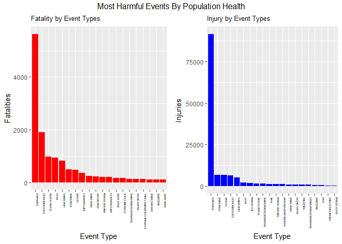
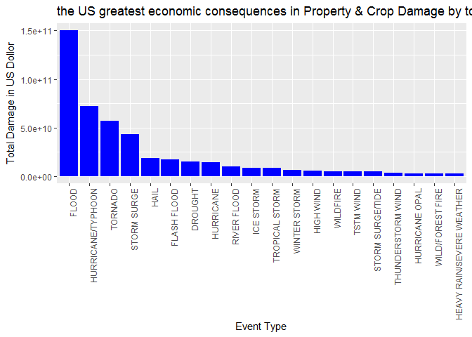

Reproducible Research Week 4
============================

Data Processing
---------------

#### Set The Directory

    setwd("C:/Users/hzarea/Desktop/Coursera/ReproducibleResearch/Week4")

#### Download and read the data and store it in stormData variable

    #download data file
    #use this one time only.  after the data is downloaded, coment it
    download.file("https://d396qusza40orc.cloudfront.net/repdata%2Fdata%2FStormData.csv.bz2", destfile = "stormData.csv.bz2")

    #read data and store in stormData
    stormDatra <- read.csv(bzfile("stormData.csv.bz2"), sep=",", header=T)

#### Get the ddiminition of the stormData

    dim(stormDatra)

    ## [1] 902297     37

#### Get the header of the stormData

    head(stormDatra)

    ##   STATE__           BGN_DATE BGN_TIME TIME_ZONE COUNTY COUNTYNAME STATE
    ## 1       1  4/18/1950 0:00:00     0130       CST     97     MOBILE    AL
    ## 2       1  4/18/1950 0:00:00     0145       CST      3    BALDWIN    AL
    ## 3       1  2/20/1951 0:00:00     1600       CST     57    FAYETTE    AL
    ## 4       1   6/8/1951 0:00:00     0900       CST     89    MADISON    AL
    ## 5       1 11/15/1951 0:00:00     1500       CST     43    CULLMAN    AL
    ## 6       1 11/15/1951 0:00:00     2000       CST     77 LAUDERDALE    AL
    ##    EVTYPE BGN_RANGE BGN_AZI BGN_LOCATI END_DATE END_TIME COUNTY_END
    ## 1 TORNADO         0                                               0
    ## 2 TORNADO         0                                               0
    ## 3 TORNADO         0                                               0
    ## 4 TORNADO         0                                               0
    ## 5 TORNADO         0                                               0
    ## 6 TORNADO         0                                               0
    ##   COUNTYENDN END_RANGE END_AZI END_LOCATI LENGTH WIDTH F MAG FATALITIES
    ## 1         NA         0                      14.0   100 3   0          0
    ## 2         NA         0                       2.0   150 2   0          0
    ## 3         NA         0                       0.1   123 2   0          0
    ## 4         NA         0                       0.0   100 2   0          0
    ## 5         NA         0                       0.0   150 2   0          0
    ## 6         NA         0                       1.5   177 2   0          0
    ##   INJURIES PROPDMG PROPDMGEXP CROPDMG CROPDMGEXP WFO STATEOFFIC ZONENAMES
    ## 1       15    25.0          K       0                                    
    ## 2        0     2.5          K       0                                    
    ## 3        2    25.0          K       0                                    
    ## 4        2     2.5          K       0                                    
    ## 5        2     2.5          K       0                                    
    ## 6        6     2.5          K       0                                    
    ##   LATITUDE LONGITUDE LATITUDE_E LONGITUDE_ REMARKS REFNUM
    ## 1     3040      8812       3051       8806              1
    ## 2     3042      8755          0          0              2
    ## 3     3340      8742          0          0              3
    ## 4     3458      8626          0          0              4
    ## 5     3412      8642          0          0              5
    ## 6     3450      8748          0          0              6

#### Get only the needed stormData

    cleanStormData <- stormDatra[,c(8,23:28)]

#### View the headers of the cleanStormData

    head(cleanStormData)

    ##    EVTYPE FATALITIES INJURIES PROPDMG PROPDMGEXP CROPDMG CROPDMGEXP
    ## 1 TORNADO          0       15    25.0          K       0           
    ## 2 TORNADO          0        0     2.5          K       0           
    ## 3 TORNADO          0        2    25.0          K       0           
    ## 4 TORNADO          0        2     2.5          K       0           
    ## 5 TORNADO          0        2     2.5          K       0           
    ## 6 TORNADO          0        6     2.5          K       0

#### Convert the property damage

    cleanStormData$PROPDMGDOLLARS = 0
    cleanStormData[cleanStormData$PROPDMGEXP == "H", ]$PROPDMGDOLLARS = cleanStormData[cleanStormData$PROPDMGEXP == "H", ]$PROPDMG * 10^2
    cleanStormData[cleanStormData$PROPDMGEXP == "K", ]$PROPDMGDOLLARS = cleanStormData[cleanStormData$PROPDMGEXP == "K", ]$PROPDMG * 10^3
    cleanStormData[cleanStormData$PROPDMGEXP == "M", ]$PROPDMGDOLLARS = cleanStormData[cleanStormData$PROPDMGEXP == "M", ]$PROPDMG * 10^6
    cleanStormData[cleanStormData$PROPDMGEXP == "B", ]$PROPDMGDOLLARS = cleanStormData[cleanStormData$PROPDMGEXP == "B", ]$PROPDMG * 10^9

    # Convert Crop Damage 
    cleanStormData$CROPDMGDOLLARS = 0
    cleanStormData[cleanStormData$CROPDMGEXP == "H", ]$CROPDMGDOLLARS = cleanStormData[cleanStormData$CROPDMGEXP == "H", ]$CROPDMG * 10^2
    cleanStormData[cleanStormData$CROPDMGEXP == "K", ]$CROPDMGDOLLARS = cleanStormData[cleanStormData$CROPDMGEXP == "K", ]$CROPDMG * 10^3
    cleanStormData[cleanStormData$CROPDMGEXP == "M", ]$CROPDMGDOLLARS = cleanStormData[cleanStormData$CROPDMGEXP == "M", ]$CROPDMG * 10^6
    cleanStormData[cleanStormData$CROPDMGEXP == "B", ]$CROPDMGDOLLARS = cleanStormData[cleanStormData$CROPDMGEXP == "B", ]$CROPDMG * 10^9

#### View the headers again to check the changes/addtions to the data

    head(cleanStormData)

    ##    EVTYPE FATALITIES INJURIES PROPDMG PROPDMGEXP CROPDMG CROPDMGEXP
    ## 1 TORNADO          0       15    25.0          K       0           
    ## 2 TORNADO          0        0     2.5          K       0           
    ## 3 TORNADO          0        2    25.0          K       0           
    ## 4 TORNADO          0        2     2.5          K       0           
    ## 5 TORNADO          0        2     2.5          K       0           
    ## 6 TORNADO          0        6     2.5          K       0           
    ##   PROPDMGDOLLARS CROPDMGDOLLARS
    ## 1          25000              0
    ## 2           2500              0
    ## 3          25000              0
    ## 4           2500              0
    ## 5           2500              0
    ## 6           2500              0

#### Load the libraries need to produce the grafics

    #load libraries
    library(ggplot2)
    library(gridExtra)

#### Group fatality data by event type and sum the result

    fatalities <- aggregate(FATALITIES ~ EVTYPE, data=cleanStormData, sum)

#### Group the injury data by event type and sum teh result

    injuries <- aggregate(INJURIES ~ EVTYPE, data = cleanStormData, sum)

#### Sort the fatality data

    #sort the fatality data
    fatalities <- fatalities[order(-fatalities$FATALITIES), ][1:20, ]

    #group by event Type
    fatalities$EVTYPE <- factor(fatalities$EVTYPE, levels = fatalities$EVTYPE)
    #get header
    head(fatalities)

    ##             EVTYPE FATALITIES
    ## 834        TORNADO       5633
    ## 130 EXCESSIVE HEAT       1903
    ## 153    FLASH FLOOD        978
    ## 275           HEAT        937
    ## 464      LIGHTNING        816
    ## 856      TSTM WIND        504

#### Sort the injury data

    #Sort the injury data
    injuries <- injuries[order(-injuries$INJURIES), ][1:20, ]

    #group the injury data
    injuries$EVTYPE <- factor(injuries$EVTYPE, levels = injuries$EVTYPE)

    #get header
    head(injuries)

    ##             EVTYPE INJURIES
    ## 834        TORNADO    91346
    ## 856      TSTM WIND     6957
    ## 170          FLOOD     6789
    ## 130 EXCESSIVE HEAT     6525
    ## 464      LIGHTNING     5230
    ## 275           HEAT     2100

#### Set the fatality plot proamters

    fatalityPlot = ggplot(fatalities, aes(x = EVTYPE, y = FATALITIES, theme_set(theme_bw()))) + 
      geom_bar(stat = "identity", fill = "red") + 
      theme(axis.text.x = element_text(angle = 90, hjust = 1, size = 4)) + 
      xlab("Event Type") + 
      ylab("Fatalities") + 
      ggtitle("Fatality by Event Types") +
      theme(plot.title = element_text(size = 10))

#### Set the injury plot pramaters

    injuryPlot = ggplot(injuries, aes(x = EVTYPE, y = INJURIES, theme_set(theme_bw()))) + 
      geom_bar(stat = "identity", fill = "blue") + 
      theme(axis.text.x = element_text(angle = 90, hjust = 1, size = 4)) + 
      xlab("Event Type") + 
      ylab("Injuries") + 
      ggtitle("Injury by Event Types") +
      theme(plot.title = element_text(size = 10))

#### Plot both the fatality and the injury data side by side

    grid.arrange(fatalityPlot, injuryPlot, ncol = 2, top = "Most Harmful Events By Population Health")

#### Organize and aggragate the data and group to Event Type and store in object "damage"

    damage <- aggregate(PROPDMGDOLLARS + CROPDMGDOLLARS ~ EVTYPE, data=cleanStormData, sum)
    names(damage) = c("EVENT_TYPE", "TOTAL_DAMAGE")

#### Get the most damage event in the US

    damage <- damage[order(-damage$TOTAL_DAMAGE), ][1:20, ]
    damage$EVENT_TYPE <- factor(damage$EVENT_TYPE, levels = damage$EVENT_TYPE)

#### Get the header of the most damage event

    head(damage)

    ##            EVENT_TYPE TOTAL_DAMAGE
    ## 170             FLOOD 150319678250
    ## 411 HURRICANE/TYPHOON  71913712800
    ## 834           TORNADO  57340613590
    ## 670       STORM SURGE  43323541000
    ## 244              HAIL  18752904670
    ## 153       FLASH FLOOD  17562128610

#### Plot the most damage event in the US

    ggplot(damage, aes(x = EVENT_TYPE, y = TOTAL_DAMAGE, theme_set(theme_bw()))) +
      geom_bar(stat = "identity", fill = "blue") + 
      theme(axis.text.x = element_text(angle = 90, hjust = 1)) + 
      xlab("Event Type") + 
      ylab("Total Damage in US Dollor") + 
      ggtitle("the US greatest economic consequences in Property & Crop Damage by top 20 Weather Events")

